<p align="center">
  
</p>

<h1 align="center">YGO Alpha</h1>

<p align="center">
  <strong>Your binder, your decks and your locals in one place.</strong><br>
  A card collection, deck builder, format checker and tournament organizer for the Yu-Gi-Oh! trading card game.
</p>

<p align="center">
  <a href="#features">Features</a> ·
  <a href="#get-started">Get started</a> ·
  <a href="docs/DEVELOPMENT.md">Developer guide</a> ·
  <a href="docs/Roadmap.md">Roadmap</a>
</p>

> **Disclaimer:** YGO Alpha is an unofficial fan project and is not affiliated with or endorsed by Konami. Yu-Gi-Oh! is a trademark of Konami.

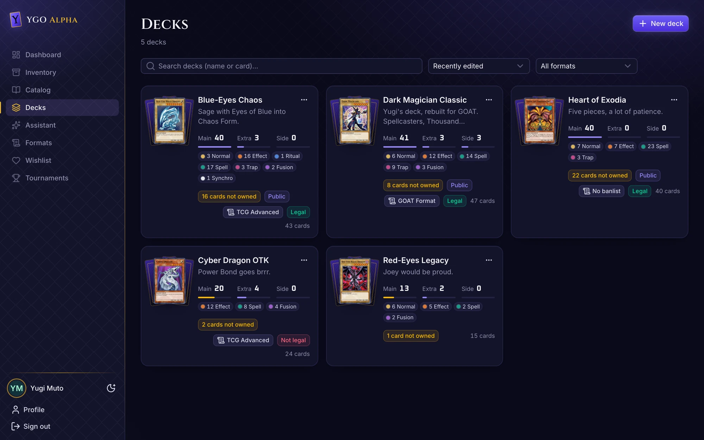

YGO Alpha answers the questions every player asks sooner or later: *Which cards do I own, and which box are
they in? Can I build this deck from my own cards? Is it legal in the format we play? And who's winning
tonight?*

You add your cards once, and the rest of the app builds on them. Decks know which cards you own. Formats check
every deck as you build it. The assistant plans with the cards in your binder, not with a netdeck you'd have to buy.

## Features

### Know what you own

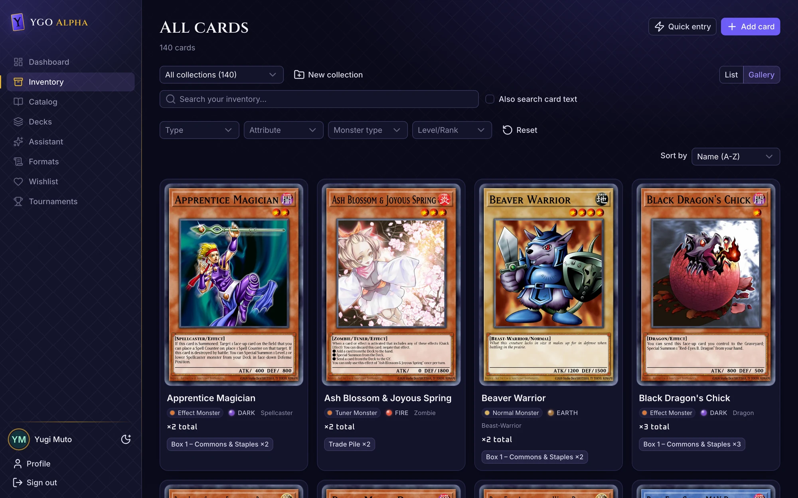

- **One inventory, split into collections the way you store your cards:** binders, boxes, a trade pile.
  Search all of them at once or one at a time.
- **Filter by type, attribute, monster type and level**, and search card text as well as names.
- **English and German.** Search finds a card by either name, and cards show the official German names and
  texts if you prefer them.

### Add a stack of cards in seconds

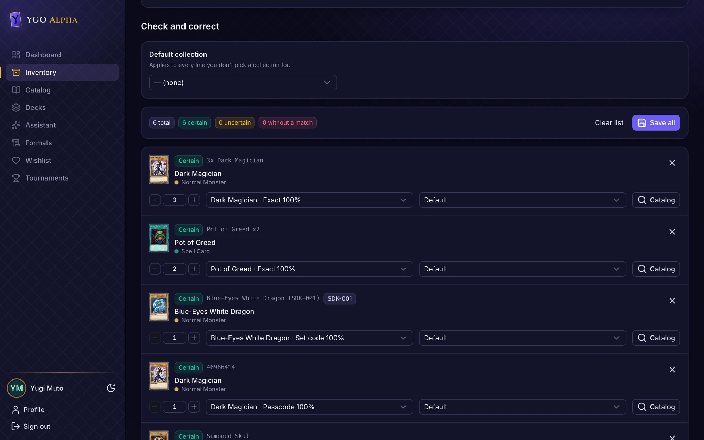

Paste or type a list, one card per line: `3x Dark Magician`, `Pot of Greed x2`, `Blue-Eyes White Dragon (SDK-001)`,
or the 8-digit passcode from the card. Quick entry matches each line to the catalog, shows how sure the match
is, catches typos, and saves nothing until you've checked the list. To add a card from a photo, send the photo
to the assistant.

### Every card, one search away

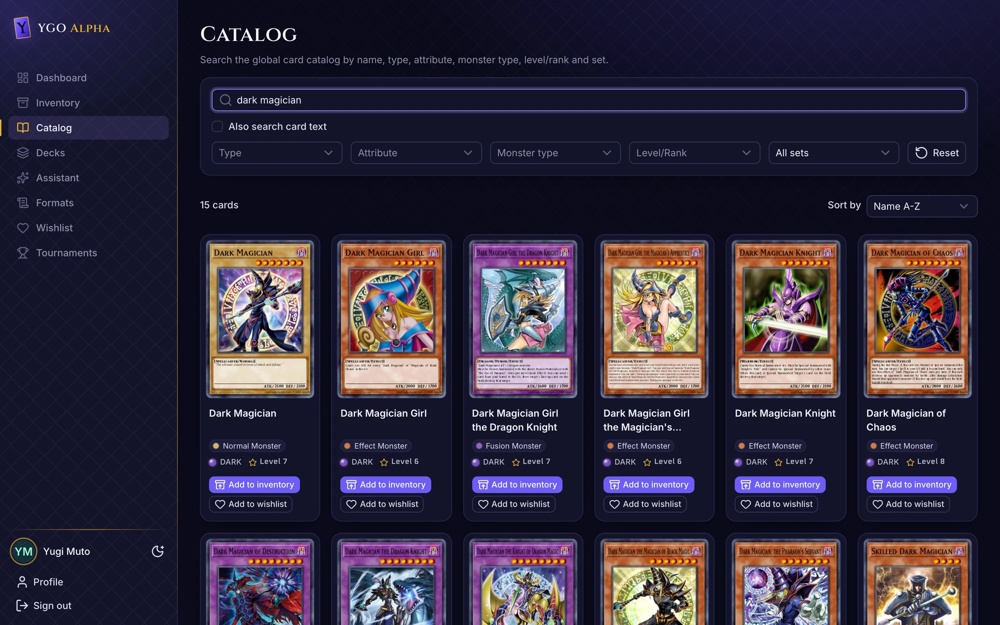

The full card catalog, synced from YGOPRODeck, with filters for type, attribute, monster type, level/rank
and set. Add any card to your inventory or your wishlist in one click.

### Build decks from the cards you actually have

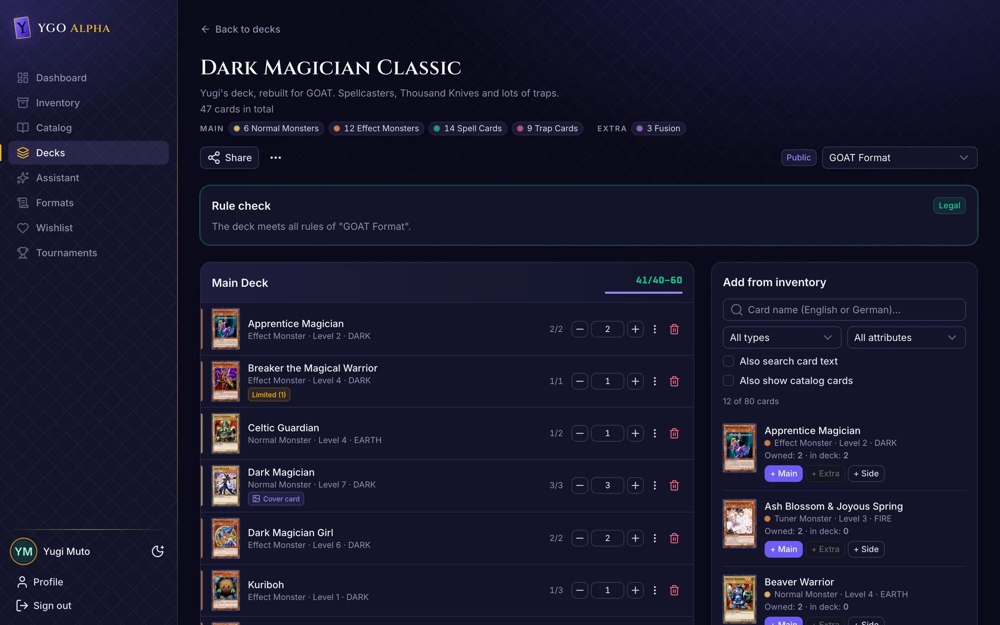

- **Main, Extra and Side Deck**, with a live count and a breakdown by card type.
- **Owned vs. used on every card** (`2/2`, `1/3`). The deck list shows how many cards you're still missing.
- **Add from your inventory**, or switch on the whole catalog to plan a deck you don't own yet.

### Formats and live legality checks

Pick a format and the rule check shows at once whether the deck is legal. Forbidden, limited and
semi-limited cards are badged right in the list.

- **Built in:** TCG Advanced, OCG, GOAT Format, Edison, Classic Plus and No banlist.
- **Make your own house rules:** clone a format or start from scratch. Combine deck sizes, copy limits,
  an official banlist, specific banned or limited cards, and filters such as *"only cards released before
  2006"* or *"effect monsters limited to one copy"*.
- Legality is **never stored**. It is recomputed on every read, so a changed card, format or catalog shows up at once.

### An assistant that knows your binder

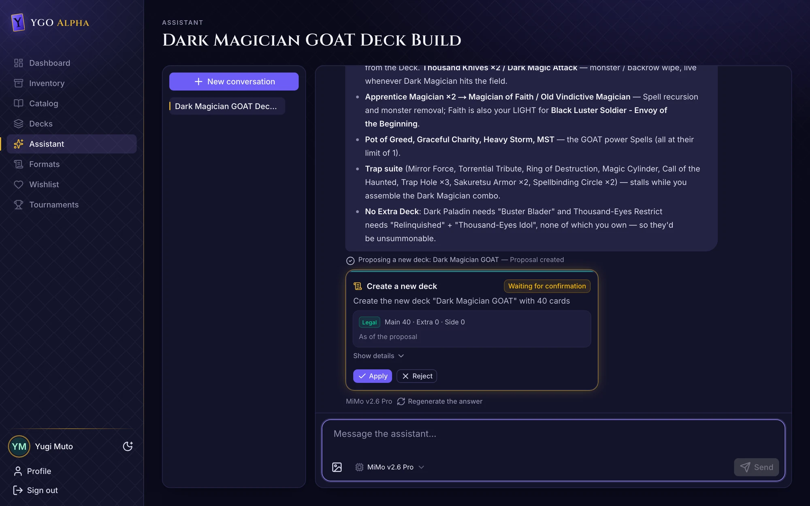

Ask it things like *"Build me a GOAT deck around Dark Magician from my cards"* or *"Which Blue-Eyes cards
do I have?"*. The assistant searches your inventory, reads card texts and checks its deck against the rule
engine before it answers. It can also recognize cards in photos.

It **never changes anything on its own**. Adding cards and creating or editing decks show up as proposals with
the legality verdict and a list of cards you'd be missing. Nothing is saved until you choose **Apply**.
It works with any OpenAI-compatible model (OpenAI, OpenRouter, Ollama, LM Studio, OpenCode, …).

### Run your locals

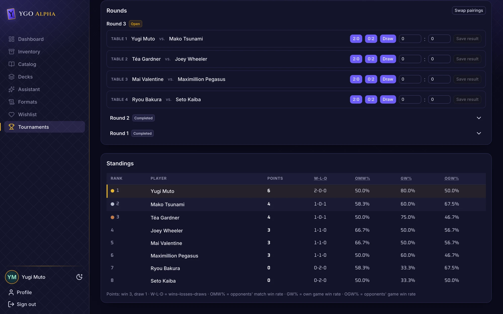

- **Swiss or round robin**, for players with an account or for guests added by name.
- **Deck registration takes a snapshot**, so later edits don't change what was played.
- **One-click results** (`2:0`, `0:2`, draw) and **standings with official-style tiebreakers**
  (points, OMW%, GW%, OGW%).

### Share with your playgroup

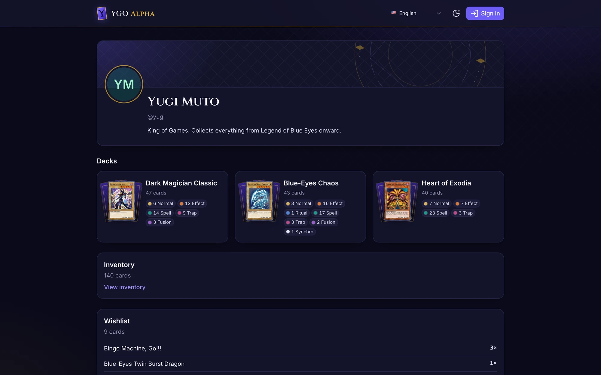

Every player gets a profile at `/players/<handle>`. You can share each deck, each collection and your whole
inventory on its own: private, link only, or public, plus access for specific players. Shared views are
read-only and never show how many copies you own. A public wishlist lets friends know what you're looking for.

### At the table, too

<p align="center">
  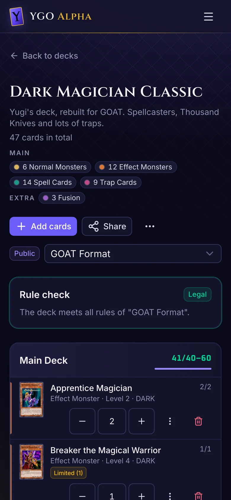
  &nbsp;
  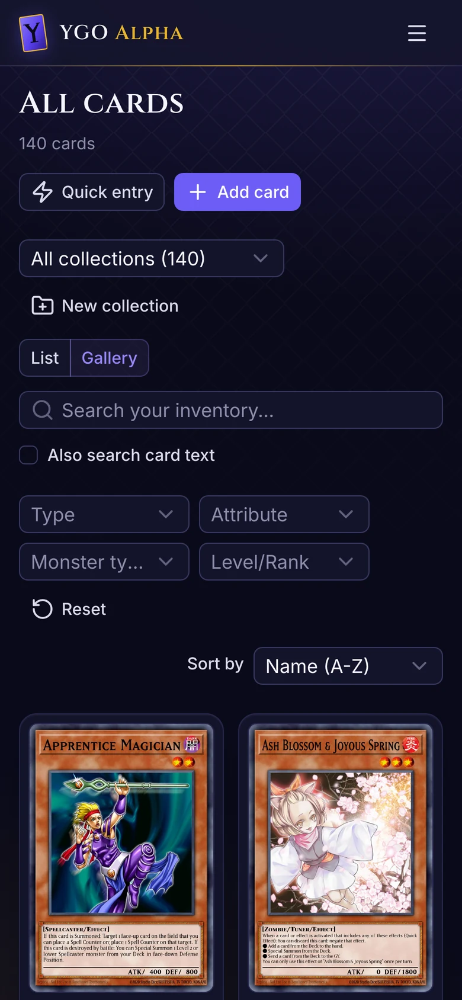
  &nbsp;
  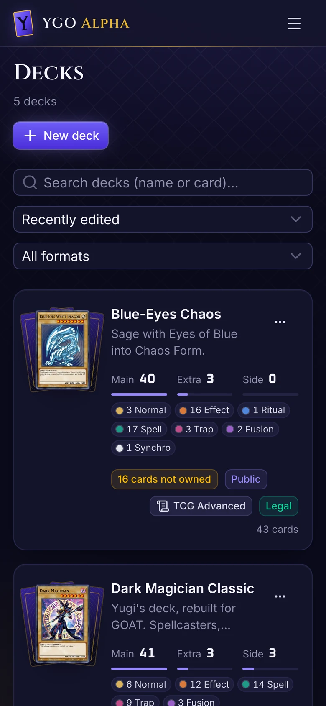
</p>

YGO Alpha is an installable web app (PWA) with layouts for phones and tablets. It comes in dark and light
mode and in English and German.

## Get started

You need Node.js 22+ and pnpm (via [Corepack](https://nodejs.org/api/corepack.html)).

```bash
corepack enable
pnpm install
pnpm dev                     # http://localhost:3000
```

Register an account, then load the card catalog once. It is fetched from YGOPRODeck and takes a moment:

```bash
curl -X POST http://localhost:3000/_nitro/tasks/catalog:sync
```

**Self-hosting with Docker:**

```bash
cat > .env <<EOF
NUXT_BETTER_AUTH_SECRET=$(openssl rand -base64 32)
NUXT_INVITE_CODE=pick-a-code-for-your-playgroup
NUXT_ADMIN_TOKEN=$(openssl rand -hex 32)
EOF
docker compose up --build -d

# load the catalog once (and again whenever you want new cards)
curl -X POST http://localhost:3000/api/admin/catalog/sync \
  -H "Authorization: Bearer $(sed -n 's/^NUXT_ADMIN_TOKEN=//p' .env)"
```

With `NUXT_INVITE_CODE` set, only people who know the code can register; without it, anyone can. On a public
host, also set `NUXT_PUBLIC_BETTER_AUTH_URL` to the app's URL. The SQLite database is stored in `./data`, and
migrations run on startup. For the assistant, set an OpenAI-compatible endpoint and key in `.env` (see
[`.env.example`](.env.example)). The app works without one, only the assistant is turned off.

The [**Developer guide**](docs/DEVELOPMENT.md) covers configuration, German card data, the rule engine in
detail, tests and the project structure.

## Built with

[Nuxt 4](https://nuxt.com) and [Nuxt UI](https://ui.nuxt.com), SQLite with [Drizzle](https://orm.drizzle.team),
[Better Auth](https://www.better-auth.com), and the [Vercel AI SDK](https://ai-sdk.dev) for the assistant.

## Documentation

- [Developer guide](docs/DEVELOPMENT.md): setup, configuration, feature internals, testing, deployment
- [Roadmap](docs/Roadmap.md): product vision and phases
- [Workflow](docs/WORKFLOW.md): branching, pull requests, CI gates
- [Architecture decisions](docs/adr/): the ADRs behind the data model, rule engine, assistant and design system

## Credits

- Card data and images: [YGOPRODeck](https://ygoprodeck.com/api-guide/).
- German card names and texts: [ygoresources.com](https://db.ygoresources.com/)
  ([card-history repo](https://github.com/db-ygoresources-com/yugioh-card-history)). The texts are Konami's.
- Card names, texts and artwork are © Konami.
